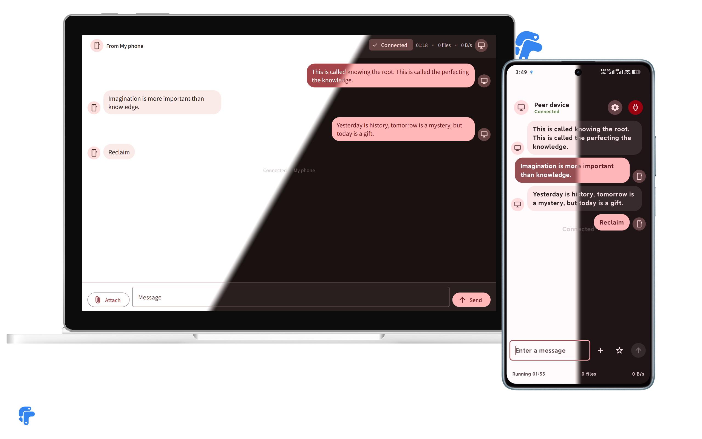
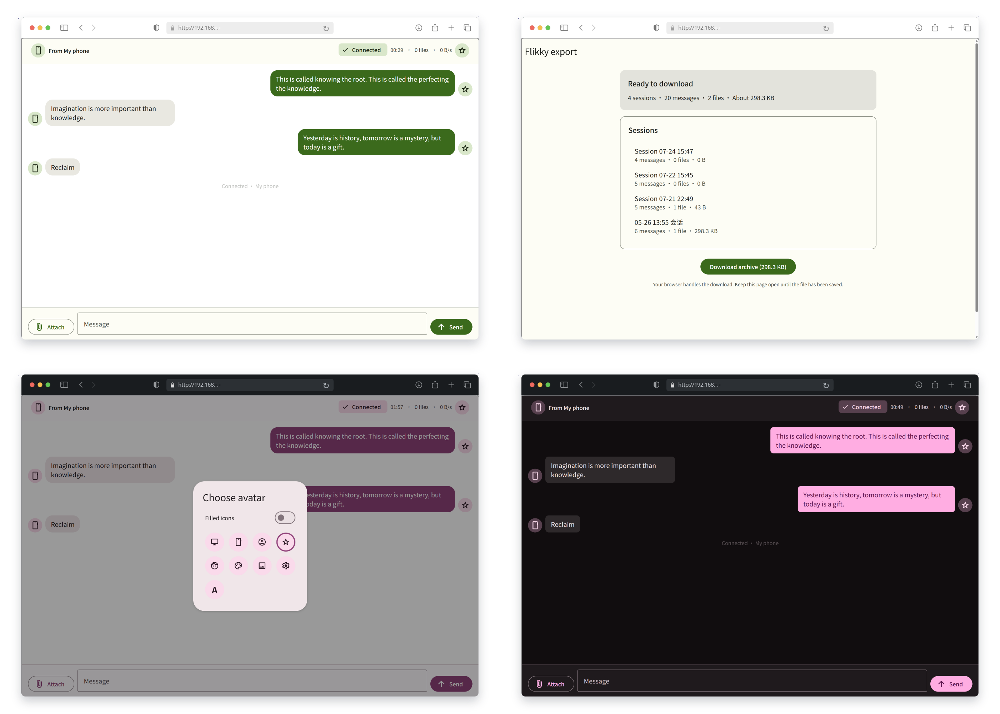

<p align="center">
  
</p>

<h1 align="center">Flikky</h1>

<p align="center">
  Account-free LAN transfer between an Android phone and any modern browser.
</p>

<p align="center">
  <strong>English</strong> · <a href="./README.zh-CN.md">简体中文</a>
</p>

Flikky turns an Android phone into a short-lived local file server. A browser on the same Wi-Fi opens the address shown by the app and can exchange text and files in real time. The browser side needs no app, extension, account, cloud service, or internet connection.

Flikky is designed for trusted local networks and keeps the operational complexity on the phone: pairing, session state, history, favorites, backup, and recovery all live in the Android app.

## Status

| Channel | Revision | State |
| --- | --- | --- |
| Stable source | [`v1.18.0`](https://github.com/Lifky/Flikky/tree/v1.18.0) · 2026-08-15 | Session timestamp dividers on both ends, keep-screen-on during a session, and a browser save-all button with per-file and ZIP download. |
| `main` | [Unreleased changes](https://github.com/Lifky/Flikky/compare/v1.18.0...main) | No unreleased changes beyond the stable tag. |

Use the stable tag for a reproducible build. Use `main` when evaluating the latest unreleased work. Per-release changes are documented in the [changelog](./docs/CHANGELOG.md); version history is available from the repository's [tags](https://github.com/Lifky/Flikky/tags).

## Screenshots






## Use Flikky

1. Install Flikky on a phone running Android 13 or newer.
2. Connect the phone and the receiving device to the same Wi-Fi network.
3. Start the transfer service in Flikky. The app shows a local URL and, by default, a one-time six-digit PIN. (Configurable in Settings.)
4. Open the URL in the browser and enter the PIN when prompted (if one is required).
5. Send text or files in either direction. Progress, connection state, and failures update in real time.
6. Stop the service when finished. The completed session remains available in History according to the configured retention policy.

The network must allow device-to-device traffic. Guest Wi-Fi and access points with client isolation can block the connection even when both devices show the same network name.

## Capabilities

- **Two-way transfer:** text and files move between Android and the browser over HTTP and WebSocket, with progress and failure states for both directions. The browser accepts drag-and-drop file uploads. Images and videos show proportional thumbnails in bubbles, with an in-app preview on Android and a fullscreen lightbox in the browser.
- **Session history:** Room-backed sessions support search, pin, rename, grouping, per-message actions, configurable retention, and crash recovery.
- **Recall and cleanup:** messages can be recalled during an active session, optionally including the other end's messages; local history items and sessions can be deleted with confirmation or undo where appropriate. Deleting a file frees its on-disk copy while History keeps an inert record.
- **Files overview:** browse files from all sessions in one place with direction/category filters, search, sorting, and multi-select actions (favorite, save, share, jump to message, delete).
- **Favorites:** keep independent text or file snapshots in collections, add local items without a session, search them, and send them back into an active transfer.
- **Portable archives:** export sessions, favorites, settings, or all data to a ZIP archive; save it on Android or serve it to a browser, then import it later. When imported sessions already exist locally, choose to skip or overwrite them.
- **Adaptive appearance:** Material 3 Expressive themes, custom theme color, dark mode, contrast, motion speed, avatars (including a browser-side avatar), bubble shape, grouping, and selected appearance settings stay aligned across phone and browser.
- **Multilingual:** both the app and the browser client support Chinese and English, and the language setting stays in sync across both ends.
- **Offline browser client:** the HTML, CSS, JavaScript, mdui components, Material Symbols font, and design tokens are bundled in the APK; no CDN is used.

## Feature Progress ● Overview

- [x] Two-way text transfer
- [x] Two-way file transfer
- [x] Session archiving
- [x] Session name search
- [x] Session message search
- [x] Jump to searched message
- [x] Session grouping
- [x] Session pinning
- [x] Session renaming
- [x] Session deletion
- [x] Session time titles
- [x] Favorites (codename: Ammo Box)
  - [x] Favorite messages
  - [x] Favorite files
  - [x] Search favorites
  - [x] Quick text copy
  - [x] Favorite collections (grouping)
  - [x] Add local text/file favorites
  - [x] Quick-send button on favorite items (requires "return to active session" enabled)
  - [x] Quick-send favorites inside a session
    - [x] Recently used (5 items)
    - [x] Quick search
    - [x] Switch collections
- [x] Quick settings inside a session
- [x] Language switching
- [x] Dynamic color
- [x] Preset themes
- [x] Custom contrast
- [x] Dark mode
- [x] AMOLED pure black
- [x] Animation speed control
- [x] Custom app-side name
- [x] Custom avatars
- [x] Preset icon avatars
- [x] Preset filled icon avatars
- [x] Single-character custom avatars
- [x] In-session avatar settings on both ends
- [x] Avatar display rules
- [x] Custom bubble corner radius
- [x] Session backgrounds
- [x] PIN configuration
- [x] Message action styles
- [x] Message recall
- [x] Message deletion
- [x] File deletion (frees storage, keeps an inert history record)
- [x] Files overview (cross-session file list with filter/search/sort and batch actions)
- [x] Browser drag-and-drop upload
- [x] Return to active session
- [x] Configurable session history retention
- [x] Export sessions/favorites
- [x] Import sessions/favorites
- [x] Export settings
- [x] Import settings
- [x] Export/import everything
- [x] Import conflict skip/overwrite
- [x] Media thumbnails in bubbles (both ends)
- [x] Image preview (in-app viewer / browser lightbox)
- [x] Browser message action styles (inline / floating)
- [x] Allow recalling peer messages
- [x] Custom theme color
- [x] Browser-side avatar
- [x] Check for updates (manual + optional auto-check)
- [x] Delete all data
- [x] Row overflow menus on favorite and session rows
- [x] Wi-Fi check before starting a transfer
- [x] Session timestamp dividers (both ends)
- [x] Keep screen on during a session
- [x] Browser save-all (per-file / ZIP archive)
- [ ] More... iterating...

## Security Model and Limits

Flikky reduces exposure, but it does not turn an untrusted LAN into a secure transport.

- The server binds only to the active Wi-Fi IPv4 address, never `0.0.0.0`, and does not depend on a cloud backend.
- PIN authentication is enabled by default. A PIN is single-use; three wrong attempts lock the source IP for 30 seconds and five wrong attempts stop the service.
- PIN authentication can be disabled in Settings. When disabled, anyone who can reach the phone on the same LAN can open the service.
- Browser responses use a strict CSP, `X-Frame-Options: DENY`, `X-Content-Type-Options: nosniff`, `Referrer-Policy: no-referrer`, HttpOnly/SameSite cookies, `textContent` rendering, and short-lived Blob download URLs.
- Notifications show the connection URL but never expose the PIN or token on the lock screen.
- The only network request outside the LAN is the optional update check, which fetches `https://api.github.com/repos/Lifky/Flikky/releases/latest` over HTTPS. It runs only when triggered manually or when auto-check is explicitly enabled (off by default), and sends no device identifier, account, or telemetry data.

Known boundaries:

- **Traffic is plaintext HTTP.** Another party able to inspect traffic on the LAN can read transferred content. Do not use Flikky for sensitive data on a hostile or shared network.
- **Browser extensions are outside the trust boundary.** An extension with page access can read the DOM despite CSP. Use a clean browser profile or a private window with extensions disabled for sensitive transfers.
- **Local data is not encrypted at rest.** Room data, stored files, favorites, and exported ZIP archives rely on Android device protection and the destination storage provider.
- Changing to a Wi-Fi network with a different IP ends the current browser connection. Reopen the new URL shown by the app.

HTTPS and encrypted local archives remain future major-version work.

## Build from Source

Prerequisites:

- JDK 17
- Android SDK Platform 37
- An Android 13+ device or emulator for installation and instrumented tests

```bash
# Build the debug APK and run JVM tests
./gradlew assembleDebug testDebugUnitTest

# Install on a connected device
./gradlew installDebug

# Run instrumented tests on a connected device/emulator
./gradlew connectedAndroidTest
```

On Windows PowerShell, point `JAVA_HOME` to JDK 17 and use the wrapper batch file:

```powershell
$env:JAVA_HOME = '<path-to-jdk-17>'
.\gradlew.bat assembleDebug testDebugUnitTest
```

The debug APK is generated at `app/build/outputs/apk/debug/app-debug.apk`.

Browser regression checks use Node.js without third-party packages:

```bash
# Browser tests (one command runs everything: syntax check + node:test suite + two DOM scripts)
node scripts/test-web.mjs
# or via Gradle (already wired into check)
./gradlew webTest
```

## Architecture

```text
Android app
├── Jetpack Compose UI
├── TransferService (foreground-service lifecycle)
│   └── Ktor CIO server ── HTTP/WebSocket ── Browser client
├── Room + app-owned files (sessions and favorites)
└── DataStore Preferences (settings)
```

| Path | Responsibility |
| --- | --- |
| `ui/` | Compose screens, ViewModels, shared components, and theme |
| `service/` | Foreground service, transfer controller, and notifications |
| `server/` | Ktor server, routes, DTOs, authentication, and WebSocket hub |
| `session/` | In-memory session state and message models |
| `data/` | Room database, repositories, file stores, and settings persistence |
| `export/` | ZIP schema, importer/exporter, snapshots, and file naming |
| `network/` | Wi-Fi IPv4 discovery and network rebind handling |
| `util/`, `di/` | Pure helpers and dependency wiring |
| `app/src/main/assets/web/` | Browser application bundled into the APK |

The project intentionally remains a single Android `:app` module. Android-specific dependencies stay out of the server and pure-logic boundaries so core behavior remains testable on the JVM.

## Contributing

- Keep changes focused and include regression coverage for behavior changes.
- Run `assembleDebug` and `testDebugUnitTest` before committing; run relevant browser checks when changing web assets.
- Preserve the network and browser security invariants described above. Never commit secrets or weaken them merely to make a test pass.
- Keep Android `Context` out of `server/`; inject platform behavior through interfaces or providers.
- Objects that survive a Wi-Fi rebind must resolve current Ktor-owned dependencies at call time instead of retaining an obsolete server instance.

## Acknowledgements

- [Ktor](https://ktor.io/) for the embedded HTTP/WebSocket server
- [mdui](https://github.com/zdhxiong/mdui) for the offline-bundled Material Design 3 Web Components

## License

MIT. See [LICENSE](./LICENSE).
