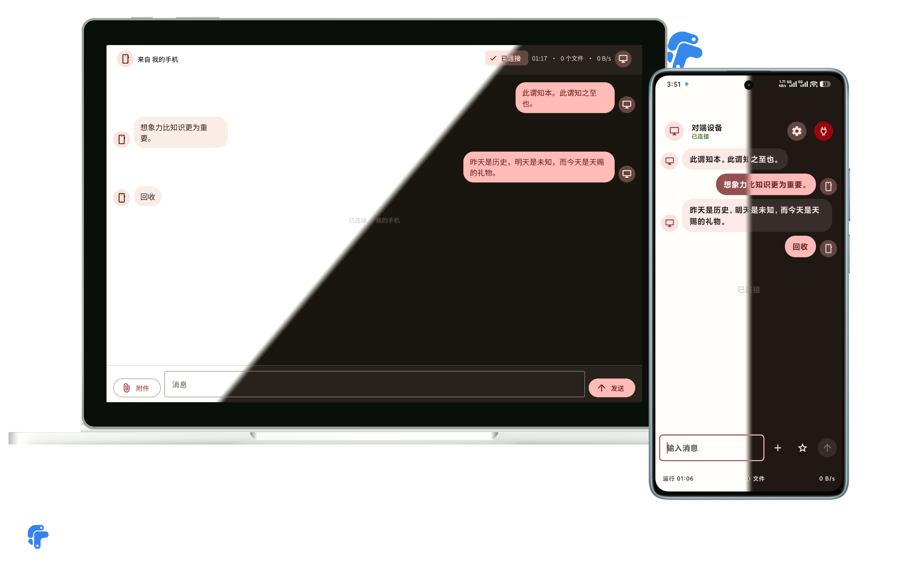
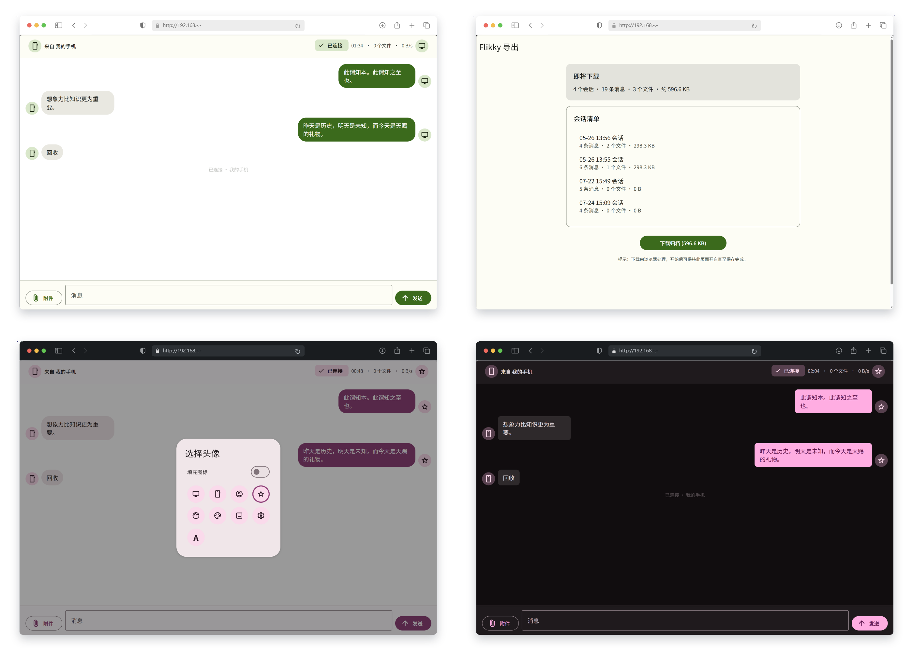

<p align="center">
  
</p>

<h1 align="center">Flikky</h1>

<p align="center">
  Android 手机与现代浏览器之间，无需账号的局域网传输工具。
</p>

<p align="center">
  <a href="./README.md">English</a> · <strong>简体中文</strong>
</p>

Flikky 会把 Android 手机变成一个短时运行的本地文件服务器。同一 Wi-Fi 下的浏览器打开 App 展示的地址，即可实时互传文本和文件。浏览器端无需安装应用、扩展，无需账号，不依赖云服务，也不需要互联网连接。

Flikky 面向可信局域网使用，并把配对、会话状态、历史记录、收藏、备份和恢复等复杂性全部留在 Android App 内处理。

## 当前状态

| 通道 | 版本 | 状态 |
| --- | --- | --- |
| 稳定版源码 | [`v1.15.0`](https://github.com/Lifky/Flikky/tree/v1.15.0) · 2026-07-22 | 英文本地化（App 与浏览器端）、网页端语言同步，以及若干 UI 细节打磨。 |
| `main` | [未发布改动](https://github.com/Lifky/Flikky/compare/v1.15.0...main) | 稳定 tag 之外暂无未发布改动。 |

需要可复现构建时使用稳定版 tag；需要评估最新但尚未发布的工作时使用 `main`。历史版本可在仓库的 [tags](https://github.com/Lifky/Flikky/tags) 中查看。

## 截图






## 使用 Flikky

1. 在 Android 13 或更高版本的手机上安装 Flikky。
2. 让手机与接收设备连接到同一 Wi-Fi。
3. 在 Flikky 中启动传输服务。App 会展示本地 URL，并默认生成一次性 6 位 PIN。（可自行设置）
4. 在浏览器中打开 URL，按提示输入 PIN。（如果有的话）
5. 双向发送文本或文件。进度、连接状态与失败反馈会实时更新。
6. 完成后停止服务。已结束会话会按照当前 History 保留策略存储在本机。（可自行设置）

局域网必须允许设备之间直接通信。Guest Wi-Fi 或开启 client isolation 的 AP 即使显示相同网络名称，也可能阻止连接。

## 主要能力

- **双向传输**：Android 与浏览器通过 HTTP + WebSocket 互传文本和文件，两端都有进度与失败状态。
- **会话历史**：基于 Room 的会话支持搜索、置顶、重命名、分组、单条消息操作、可配置保留数量和 crash recovery。
- **撤回与清理**：进行中会话可以撤回消息；History 消息与整个会话可按场景二次确认或撤销删除。
- **收藏**：把文本或文件保留为独立快照，按合集管理；也可脱离会话添加本地内容、搜索，并快速发回进行中的会话。
- **可迁移归档**：会话、收藏、设置或全部数据均可导出为 ZIP；支持保存到 Android 本机或交给浏览器下载，并可在之后重新导入。
- **自适应外观**：Material 3 Expressive 主题、深色模式、对比度、动画速度、头像、气泡形状与头像分组等设置可在手机与浏览器之间保持一致。
- **多语言**：App 与浏览器端均支持中文和英文，语言设置双端同步。
- **极简离线浏览器端**：HTML、CSS、JavaScript、mdui 组件、Material Symbols font 与 design token 全部打包进 APK，不使用 CDN。

## 功能进度 ● 概览

- [x] 双向文本传输
- [x] 双向文件传输
- [x] 会话归档
- [x] 会话名称搜索
- [x] 会话消息搜索
- [x] 搜索消息定位
- [x] 会话分组功能
- [x] 会话置顶
- [x] 会话重命名
- [x] 会话删除
- [x] 会话时间 title
- [x] 收藏功能（代号：弹药箱）
  - [x] 消息收藏
  - [x] 文件收藏
  - [x] 搜索收藏
  - [x] 文本快速复制
  - [x] 收藏合集（分组）功能
  - [x] 本地添加文本/文件收藏
  - [x] 收藏项快捷发送按钮（需开启“允许会话中返回”功能）
  - [x] 会话中快捷发送收藏
    - [x] 最近使用（ 5 项）
    - [x] 快捷搜索
    - [x] 切换合集
- [x] 会话中快捷设置
- [x] 语言切换
- [x] 动态取色
- [x] 预设主题
- [x] 自定义对比度
- [x] 深色模式
- [x] AMOLED 纯黑
- [x] 动画速度调节
- [x] 自定义 APP 端名称
- [x] 自定义头像
- [x] 预设 icon 头像
- [x] 预设填充 icon 头像
- [x] 单字符自定义头像
- [x] 双端会话中头像设置
- [x] 头像显示规则
- [x] 气泡自定义圆角
- [x] 会话背景
- [x] PIN 码设置
- [x] 消息操作样式
- [x] 撤回消息
- [x] 删除消息
- [x] 会话中返回
- [x] 会话历史保存数量自定义
- [x] 导出会话/收藏
- [x] 导入会话/收藏
- [x] 导出设置
- [x] 导入设置
- [x] 全部导出/导入
- [ ] 更多...迭代中...

## 安全模型与边界

Flikky 会减少暴露面，但不会把不可信局域网变成安全传输通道。

- Server 只绑定当前 Wi-Fi IPv4，绝不监听 `0.0.0.0`，也不依赖 cloud backend。
- PIN 认证默认开启。PIN 成功使用一次后立即作废；连续错 3 次会锁定来源 IP 30 秒，错 5 次会停止服务。
- 可在设置中关闭 PIN。关闭后，只要同一 LAN 内的设备能访问手机地址，就能直接打开服务。
- 浏览器响应使用严格 CSP、`X-Frame-Options: DENY`、`X-Content-Type-Options: nosniff`、`Referrer-Policy: no-referrer`、HttpOnly/SameSite Cookie、`textContent` 渲染和短生命周期 Blob 下载 URL。
- 通知栏只展示连接 URL，不会在锁屏上暴露 PIN 或 token。

已知边界：

- **传输使用 HTTP 明文。** 能监听局域网流量的第三方可以读取传输内容，不要在不可信或共享网络中传输敏感数据。
- **浏览器扩展不在信任边界内。** 拥有页面访问权限的 extension 即使面对 CSP 也能读取 DOM。敏感传输应使用干净的浏览器 profile，或在禁用扩展的隐私窗口中进行。
- **本地数据没有 at-rest encryption。** Room 数据、落盘文件、收藏与导出的 ZIP 依赖 Android 设备保护和目标存储提供方。
- 切换到不同 IP 的 Wi-Fi 后，当前浏览器连接会结束，需要重新打开 App 展示的新 URL。

HTTPS 与加密本地归档仍属于未来大版本工作。

## 从源码构建

前置条件：

- JDK 17
- Android SDK Platform 37
- 用于安装和 instrumented tests 的 Android 13+ 设备或 emulator

```bash
# 构建 Debug APK 并运行 JVM tests
./gradlew assembleDebug testDebugUnitTest

# 安装到已连接设备
./gradlew installDebug

# 在已连接设备或 emulator 上运行 instrumented tests
./gradlew connectedAndroidTest
```

Windows PowerShell 需要把 `JAVA_HOME` 指向 JDK 17，并使用 Gradle Wrapper 的 batch 文件：

```powershell
$env:JAVA_HOME = '<path-to-jdk-17>'
.\gradlew.bat assembleDebug testDebugUnitTest
```

Debug APK 输出到 `app/build/outputs/apk/debug/app-debug.apk`。

浏览器端回归检查只依赖 Node.js，不需要第三方 package：

```bash
node --check app/src/main/assets/web/app.js
node --test app/src/test/web/app-avatar-default.test.js
node scripts/test-web-avatar-reflow.js
node scripts/test-web-login-theme.js
```

## 架构

```text
Android App
├── Jetpack Compose UI
├── TransferService（前台服务生命周期）
│   └── Ktor CIO server ── HTTP/WebSocket ── 浏览器端
├── Room + App 私有文件（会话与收藏）
└── DataStore Preferences（设置）
```

| 路径 | 职责 |
| --- | --- |
| `ui/` | Compose Screen、ViewModel、共享组件与主题 |
| `service/` | 前台服务、TransferController 与通知 |
| `server/` | Ktor server、route、DTO、认证与 WebSocket hub |
| `session/` | 会话内存状态与 Message model |
| `data/` | Room database、Repository、file store 与设置持久化 |
| `export/` | ZIP schema、importer/exporter、snapshot 与文件命名 |
| `network/` | Wi-Fi IPv4 获取与 network rebind |
| `util/`、`di/` | 纯逻辑 helper 与依赖装配 |
| `app/src/main/assets/web/` | 打包进 APK 的浏览器应用 |

项目刻意保持单 Android `:app` module。Android 平台依赖不会穿透到 `server/` 和纯逻辑边界，因此核心行为可以在 JVM 上测试。

## 参与开发

- 保持改动聚焦；任何行为变化都应补对应 regression coverage。
- Commit 前运行 `assembleDebug` 与 `testDebugUnitTest`；修改 web assets 时同时运行相关浏览器检查。
- 保持上文的 network 与 browser 安全约束。不得提交 secret，也不得为了让测试通过而削弱安全边界。
- 不把 Android `Context` 穿透到 `server/`；通过 interface 或 provider 注入平台行为。
- 生命周期跨越 Wi-Fi rebind 的对象，必须在调用时解析当前 Ktor 依赖，不能持有已经失效的 server instance。

## 致谢

- [Ktor](https://ktor.io/)：内嵌 HTTP/WebSocket server
- [mdui](https://github.com/zdhxiong/mdui)：以离线方式打包的 Material Design 3 Web Components

## 许可证

MIT，见 [LICENSE](./LICENSE)。
