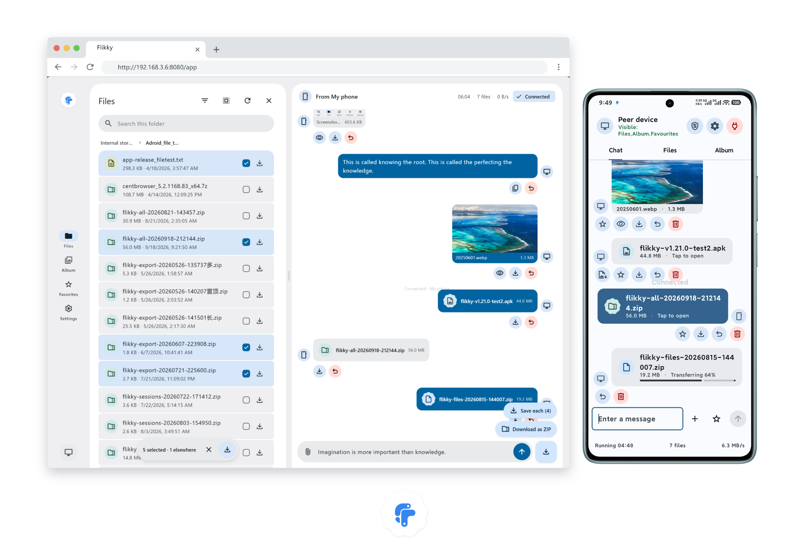
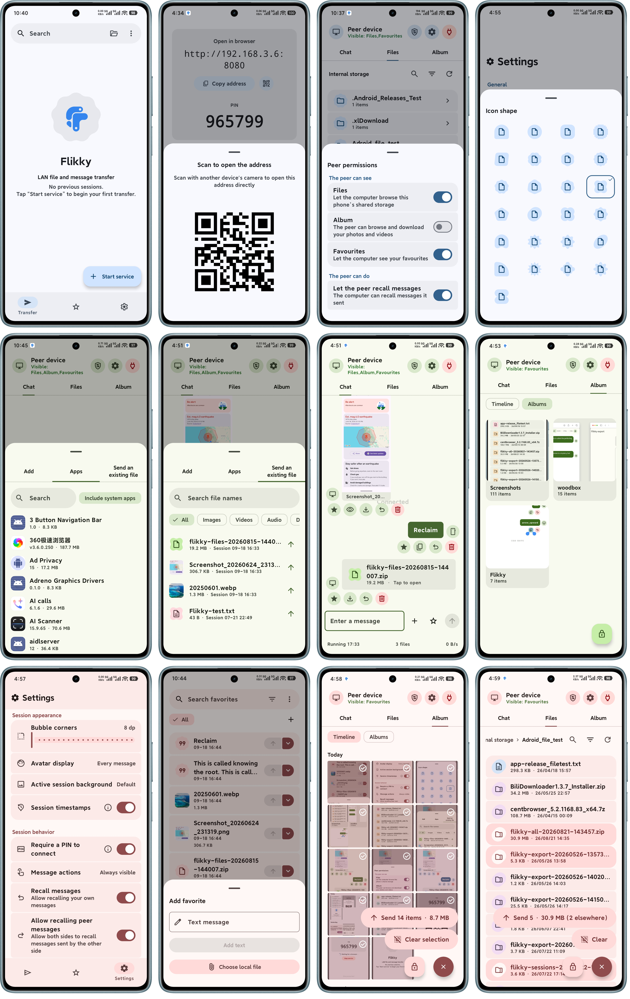
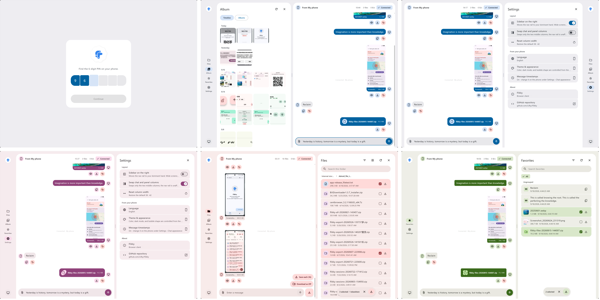
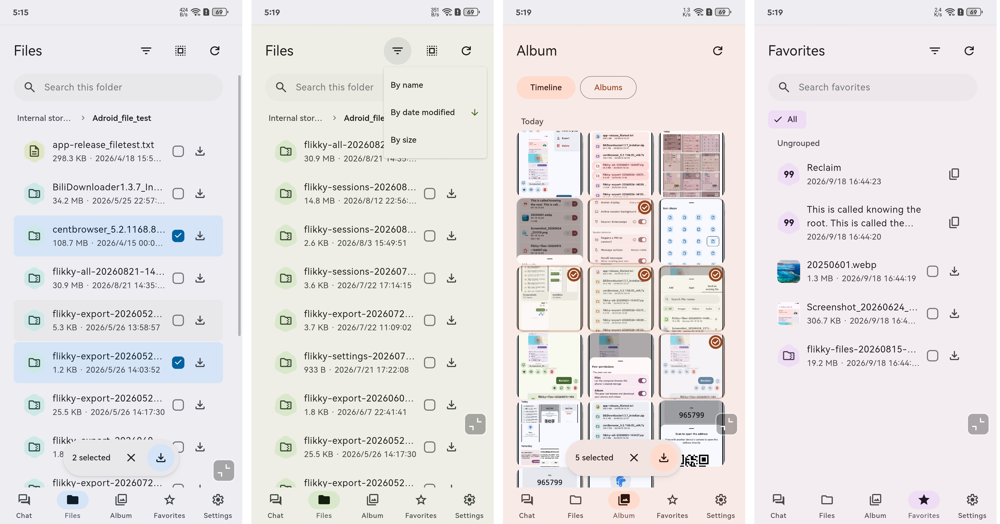
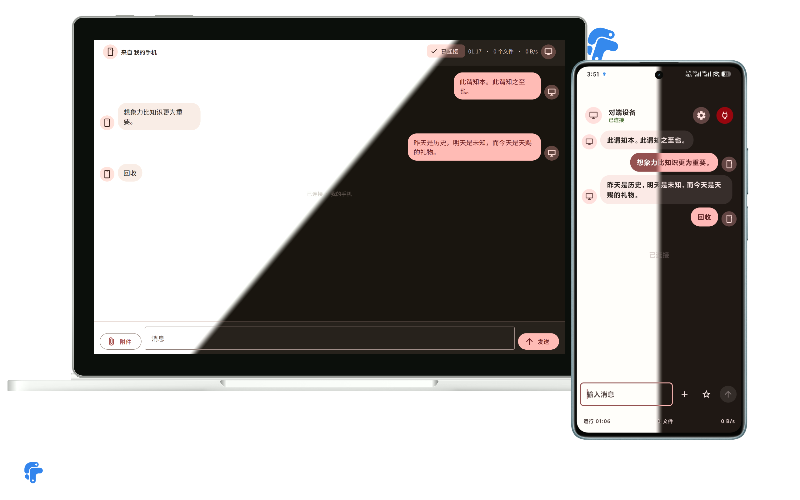
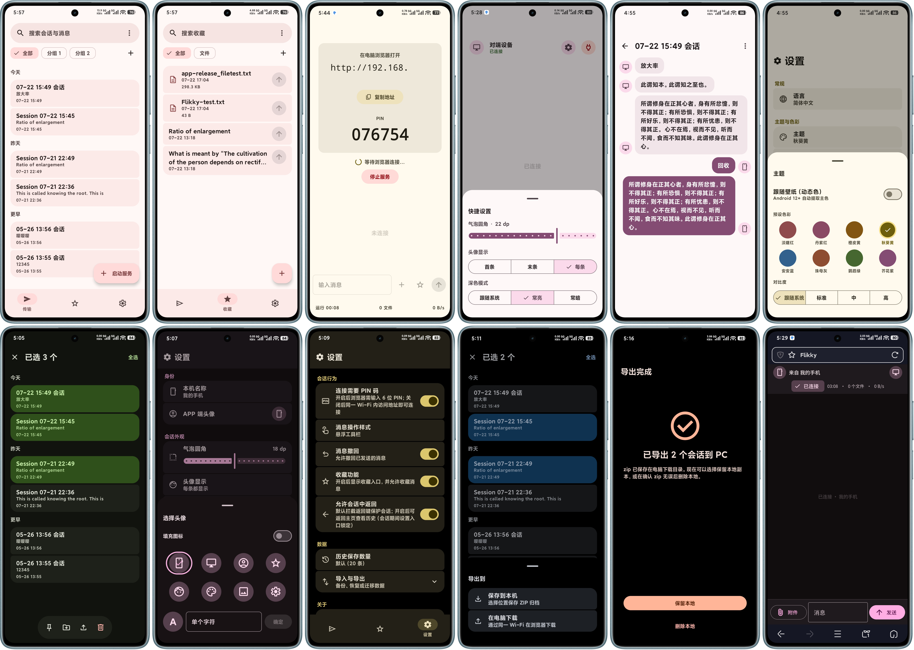
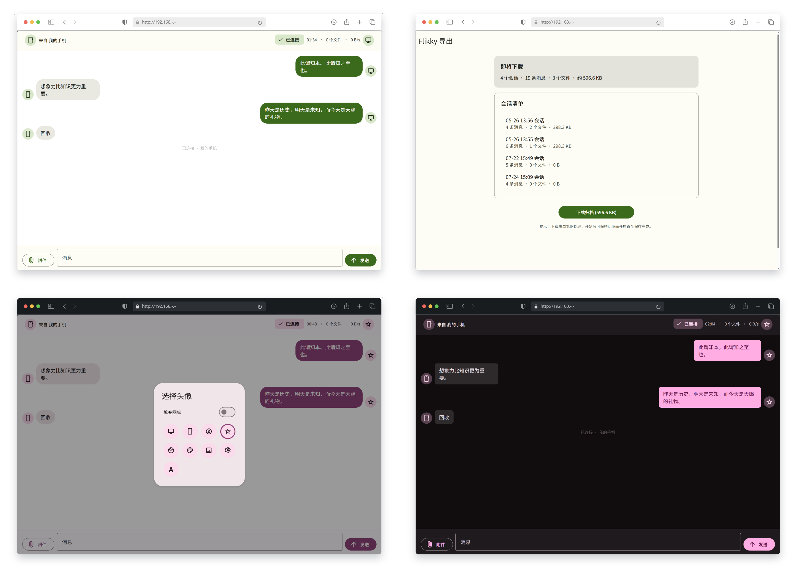

<p align="center">
  
</p>

<h1 align="center">Flikky</h1>

<p align="center">
  Android 手机与现代浏览器之间，无需账号的局域网传输工具。
</p>

<p align="center">
  <a href="./README.md">English</a> · <strong>简体中文</strong>
</p>

Flikky 会把 Android 手机变成一个短时运行的本地文件服务器。同一 Wi-Fi 下的浏览器打开 App 展示的地址，即可实时互传文本和文件。浏览器端无需安装应用、扩展，无需账号，不依赖云服务，也不需要互联网连接。

Flikky 面向可信局域网使用，并把配对、会话状态、历史记录、收藏、备份和恢复等复杂性全部留在 Android App 内处理。

## 当前状态

| 通道 | 版本 | 状态                                                                           |
| --- | --- |------------------------------------------------------------------------------|
| 稳定版源码 | [`v1.21.0`](https://github.com/Lifky/Flikky/tree/v1.21.0) · 2026-09-19 | 手机相册在两端均可按时间线或相册文件夹浏览，已安装应用可提取 APK 发送并在对端安装，连接卡片提供地址二维码，对端权限面板明确说明浏览器可见哪些通道。 |
| `main` | [未发布改动](https://github.com/Lifky/Flikky/compare/v1.21.0...main) | 稳定 tag 之外暂无未发布改动。                                                            |

需要可复现构建时使用稳定版 tag；需要评估最新但尚未发布的工作时使用 `main`。各版本变更详见 [更新日志](./docs/CHANGELOG.zh-CN.md)，历史版本可在仓库的 [tags](https://github.com/Lifky/Flikky/tags) 中查看。

## 截图



### App



### 浏览器



### 移动浏览器



<details>
<summary>v1.19.0 以前 ● 展开</summary>







</details>

## 使用 Flikky

1. 在 Android 13 或更高版本的手机上安装 Flikky。
2. 让手机与接收设备连接到同一 Wi-Fi。
3. 在 Flikky 中启动传输服务。App 会展示本地 URL，并默认生成一次性 6 位 PIN。（可自行设置）
4. 在浏览器中打开 URL，按提示输入 PIN。（如果有的话）
5. 双向发送文本或文件。进度、连接状态与失败反馈会实时更新。
6. 完成后停止服务。已结束会话会按照当前 History 保留策略存储在本机。（可自行设置）

局域网必须允许设备之间直接通信。Guest Wi-Fi 或开启 client isolation 的 AP 即使显示相同网络名称，也可能阻止连接。

## 主要能力

- **双向传输**：Android 与浏览器通过 HTTP + WebSocket 互传文本和文件，两端都有进度与失败状态。浏览器端支持拖放上传文件。图片与视频在气泡中以等比缩略图展示，Android 端可应用内预览，浏览器端有全屏 lightbox。
- **会话历史**：基于 Room 的会话支持搜索、置顶、重命名、分组、单条消息操作、可配置保留数量和 crash recovery。
- **撤回与清理**：进行中会话可以撤回消息，可选择允许撤回对端消息；History 消息与整个会话可按场景二次确认或撤销删除。删除文件会释放本地磁盘副本，History 中保留不可交互的记录。
- **文件总览**：在一处浏览所有会话的文件，支持方向/类别筛选、搜索、排序与多选操作（收藏、保存、分享、跳转到消息、删除）。
- **浏览手机存储**：打开默认关闭的开关后，手机自己的存储在会话页「文件」tab 与浏览器端「文件」面板都可浏览——面包屑导航、目录内搜索、排序、图片与视频的缩略图与预览；浏览器端可批量下载，手机端可跨目录多选发进会话。Flikky 只读取。
- **浏览手机相册**：两端都可按拍摄日期的时间线或相册文件夹网格浏览。手机端长按后拖动可连选一段，浏览器端可逐格勾选并批量下载。拍摄日期在手机上算一次，因此两端永远把同一张照片分到同一天。使用 Android 的窄口径媒体权限（含 Android 14+「仅选定照片」），而非「所有文件访问」。
- **发送已安装的应用**：搜索已安装应用，Flikky 提取所选应用的 base APK 并以 `应用名_版本.apk` 发进会话。APK 行提供安装操作，由系统安装器接手。含 split APK 的应用只发送 base.apk，并给出明确警示。
- **对端权限集中管理**：会话头部的面板把每条通道标为不可用、关或开，于是「开关开着却什么都没有」不会成为一条沉默的死路。头部常驻显示当前开放了哪些通道，文件与相册 tab 各有一个锁，不离开界面就能关闭该通道。关闭通道同时会切断已在进行中的传输。
- **免输入地址**：连接卡片上的二维码按钮打开一个装着二维码的 sheet。它只编码 URL——一次性 PIN 仍留在手机屏幕上。
- **收藏**：把文本或文件保留为独立快照，按合集管理；也可脱离会话添加本地内容、搜索，并快速发回进行中的会话。
- **可迁移归档**：会话、收藏、设置或全部数据均可导出为 ZIP；支持保存到 Android 本机或交给浏览器下载，并可在之后重新导入。导入的会话在本地已存在时，可选择跳过或覆盖。
- **自适应外观**：Material 3 Expressive 主题、自定义主题色、深色模式、对比度、动画速度、头像（含浏览器端头像）、气泡形状、头像分组、行首容器的形状与分类配色等设置可在手机与浏览器之间保持一致。
- **多语言**：App 与浏览器端均支持中文和英文，语言设置双端同步。
- **极简离线浏览器端**：HTML、CSS、JavaScript、mdui 组件、Material Symbols font 与 design token 全部打包进 APK，不使用 CDN。

## 功能进度 ● 概览

- [x] 双向文本传输
- [x] 双向文件传输
- [x] 会话归档
- [x] 会话名称搜索
- [x] 会话消息搜索
- [x] 搜索消息定位
- [x] 会话分组功能
- [x] 会话置顶
- [x] 会话重命名
- [x] 会话删除
- [x] 会话时间 title
- [x] 收藏功能（代号：弹药箱）
  - [x] 消息收藏
  - [x] 文件收藏
  - [x] 搜索收藏
  - [x] 文本快速复制
  - [x] 收藏合集（分组）功能
  - [x] 本地添加文本/文件收藏
  - [x] 收藏项快捷发送按钮（需开启“允许会话中返回”功能）
  - [x] 会话中快捷发送收藏
    - [x] 最近使用（ 5 项）
    - [x] 快捷搜索
    - [x] 切换合集
- [x] 会话中快捷设置
- [x] 语言切换
- [x] 动态取色
- [x] 预设主题
- [x] 自定义对比度
- [x] 深色模式
- [x] AMOLED 纯黑
- [x] 动画速度调节
- [x] 自定义 APP 端名称
- [x] 自定义头像
- [x] 预设 icon 头像
- [x] 预设填充 icon 头像
- [x] 单字符自定义头像
- [x] 双端会话中头像设置
- [x] 头像显示规则
- [x] 气泡自定义圆角
- [x] 会话背景
- [x] PIN 码设置
- [x] 消息操作样式
- [x] 撤回消息
- [x] 删除消息
- [x] 删除文件（释放存储，保留不可交互记录）
- [x] 文件总览（跨会话文件列表，筛选/搜索/排序与批量操作）
- [x] 浏览器拖放上传
- [x] 会话中返回
- [x] 会话历史保存数量自定义
- [x] 导出会话/收藏
- [x] 导入会话/收藏
- [x] 导出设置
- [x] 导入设置
- [x] 全部导出/导入
- [x] 导入冲突跳过/覆盖
- [x] 气泡媒体缩略图（双端）
- [x] 图片预览（应用内预览 / 浏览器 lightbox）
- [x] 浏览器端消息操作样式（内联 / 悬浮）
- [x] 允许撤回对端消息
- [x] 自定义主题色
- [x] 浏览器端头像
- [x] 检查更新（手动 + 可选自动）
- [x] 删除全部数据
- [x] 收藏行与会话行的行内菜单
- [x] 开始传输前的 Wi-Fi 检查
- [x] 会话时间戳分隔条（双端）
- [x] 会话中保持屏幕常亮
- [x] 浏览器端一键保存（逐个 / ZIP 打包）
- [x] 浏览器端 Material 3 Expressive 重设计（三段式外壳 / 窄屏底部导航 / 可拖拽分栏）
- [x] 浏览器端收藏面板（搜索、分类筛选、多选批量保存）
- [x] 浏览器端设置面板（布局偏好、手机端只读项、关于）
- [x] 浏览器端跟随 AMOLED 纯黑
- [x] 会话页「文件」tab：浏览手机存储、跨目录多选发送
- [x] 浏览器端「文件」面板：远程浏览手机存储并下载（挂在默认关闭的开关后面）
- [x] 手机自己当热点时也能绑到正确地址
- [x] 六处排序（主页、收藏页、文件总览、文件 tab、浏览器端文件/收藏面板），每处与每端各记各的
- [x] 双端目录内搜索
- [x] 主页分节方式（不分节 / 按状态 / 按日期）
- [x] 显示隐藏文件
- [x] 存储列表与收藏面板的缩略图与预览（双端）
- [x] 缩略图缓存：上限、占用显示与一键清空
- [x] 行首容器形状可定制（25 个官方 Material 3 Expressive 形状）
- [x] 行首容器配色可定制（单色 / 和谐色 / 固定色）
- [x] 压缩包独立为文件分类
- [x] 对端权限面板，每条通道三态（不可用 / 关 / 开）
- [x] 文件与相册 tab 内的通道锁
- [x] 关闭对端通道会切断已在进行中的传输
- [x] 会话页「相册」tab：按拍摄日期的时间线，长按后拖动连选
- [x] 浏览器「相册」面板：缩略图自动换行、逐格选择、批量下载
- [x] 两端均可按相册文件夹浏览
- [x] 窄口径媒体权限，含 Android 14+「仅选定照片」
- [x] 加号 sheet「应用」tab：提取并发送已安装应用的 base APK
- [x] 在文件总览、聊天气泡与历史记录中安装 APK
- [x] APK 安装包独立为文件分类
- [x] 连接地址二维码（只编码 URL）
- [ ] 更多...迭代中...

## 安全模型与边界

Flikky 会减少暴露面，但不会把不可信局域网变成安全传输通道。

- Server 只绑定当前 Wi-Fi 或手机系统热点的具体私有 IPv4，绝不监听 `0.0.0.0`，绝不绑定蜂窝或 VPN 接口，也不依赖 cloud backend。
- PIN 认证默认开启。PIN 成功使用一次后立即作废；连续错 3 次会锁定来源 IP 30 秒，错 5 次会停止服务。
- 可在设置中关闭 PIN。关闭后，只要同一 LAN 内的设备能访问手机地址，就能直接打开服务。
- 浏览器响应使用严格 CSP、`X-Frame-Options: DENY`、`X-Content-Type-Options: nosniff`、`Referrer-Policy: no-referrer`、HttpOnly/SameSite Cookie、`textContent` 渲染和短生命周期 Blob 下载 URL。
- 通知栏只展示连接 URL，不会在锁屏上暴露 PIN 或 token。
- 「允许电脑浏览手机存储」是显式开关，**新安装默认关闭**。关闭时浏览器端不显示「文件」入口，且服务端所有存储接口一律返回 `404`。
- 列出文件需要声明 `MANAGE_EXTERNAL_STORAGE`（所有文件访问）。**Android 未提供只读版的该权限**，因此授权时系统会一并授予写入能力——Flikky 只读取，不写入、不修改、不删除共享存储中的任何内容。`Android/data` 与 `Android/obb` 仍不可访问，那是系统锁死的，与本权限无关。
- 浏览手机相册由它自己的开关门控，**新安装默认关闭**，并使用 Android 的窄口径媒体权限（`READ_MEDIA_IMAGES` / `READ_MEDIA_VIDEO`）而非「所有文件访问」。支持 Android 14+ 的「仅选定照片」；在部分授权下，App 会说明当前能看到多少项。
- 浏览器端永远看不到原始 content URI。它只用不透明的 `img:<id>` / `vid:<id>` 标识寻址相册项，由服务端从两个固定的 MediaStore collection 重建 URI —— 对端因此无法引导 App 用它自己的权限去读取任意 content provider。
- **关闭对端通道会切断已在进行中的传输。** 存储与相册两条流在每个 64 KB 块之前重新读取门控，而不是在请求到达时只检查一次。
- 发送已安装应用只读取该应用自身的 APK 路径，这是 Android 对任何持有 `QUERY_ALL_PACKAGES` 的应用都公开的信息。安装 APK 是把文件交给系统安装器；Flikky 自己从不执行安装，也不申请静默安装能力。
- **二维码只编码连接 URL。** 一次性 PIN 绝不放进二维码 —— 可被扫走的凭据本身就是一条新的泄露路径。
- 共享存储文件的缩略图缓存在应用自己的私有目录里，不会写进共享存储。缓存有用户可选的上限（选 0 即完全不缓存），可在设置中清空，「删除全部数据」也会一并清除。
- 这里用不了 SAF：Android 11+ 的 `ACTION_OPEN_DOCUMENT_TREE` 禁止授权内部存储根目录与 Download 目录，表达不出「浏览全部共享存储」。
- 局域网之外唯一的网络请求是可选的检查更新，仅通过 HTTPS 访问 `https://api.github.com/repos/Lifky/Flikky/releases/latest`。只在手动触发或显式开启自动检查（默认关闭）后发起，不携带任何设备标识、账号或遥测数据。

已知边界：

- **传输使用 HTTP 明文。** 能监听局域网流量的第三方可以读取传输内容，不要在不可信或共享网络中传输敏感数据。
- **浏览器扩展不在信任边界内。** 拥有页面访问权限的 extension 即使面对 CSP 也能读取 DOM。敏感传输应使用干净的浏览器 profile，或在禁用扩展的隐私窗口中进行。
- **本地数据没有 at-rest encryption。** Room 数据、落盘文件、收藏与导出的 ZIP 依赖 Android 设备保护和目标存储提供方。
- 切换到不同 IP 的 Wi-Fi 后，当前浏览器连接会结束，需要重新打开 App 展示的新 URL。

HTTPS 与加密本地归档仍属于未来大版本工作。

## 从源码构建

前置条件：

- JDK 17
- Android SDK Platform 37
- 用于安装和 instrumented tests 的 Android 13+ 设备或 emulator

```bash
# 构建 Debug APK 并运行 JVM tests
./gradlew assembleDebug testDebugUnitTest

# 安装到已连接设备
./gradlew installDebug

# 在已连接设备或 emulator 上运行 instrumented tests
./gradlew connectedAndroidTest
```

Windows PowerShell 需要把 `JAVA_HOME` 指向 JDK 17，并使用 Gradle Wrapper 的 batch 文件：

```powershell
$env:JAVA_HOME = '<path-to-jdk-17>'
.\gradlew.bat assembleDebug testDebugUnitTest
```

Debug APK 输出到 `app/build/outputs/apk/debug/app-debug.apk`。

浏览器端回归检查只依赖 Node.js，不需要第三方 package：

```bash
# 浏览器端测试（一条命令跑全部：语法检查 + node:test 套件 + 两个 DOM 脚本）
node scripts/test-web.mjs
# 或经 Gradle（已挂在 check 上）
./gradlew webTest
```

## 架构

```text
Android App
├── Jetpack Compose UI
├── TransferService（前台服务生命周期）
│   └── Ktor CIO server ── HTTP/WebSocket ── 浏览器端
├── Room + App 私有文件（会话与收藏）
└── DataStore Preferences（设置）
```

| 路径 | 职责 |
| --- | --- |
| `ui/` | Compose Screen、ViewModel、共享组件与主题 |
| `service/` | 前台服务、TransferController 与通知 |
| `server/` | Ktor server、route、DTO、认证与 WebSocket hub |
| `session/` | 会话内存状态与 Message model |
| `data/` | Room database、Repository、file store 与设置持久化 |
| `export/` | ZIP schema、importer/exporter、snapshot 与文件命名 |
| `network/` | Wi-Fi IPv4 获取与 network rebind |
| `util/`、`di/` | 纯逻辑 helper 与依赖装配 |
| `app/src/main/assets/web/` | 打包进 APK 的浏览器应用 |

项目刻意保持单 Android `:app` module。Android 平台依赖不会穿透到 `server/` 和纯逻辑边界，因此核心行为可以在 JVM 上测试。

## 参与开发

- 保持改动聚焦；任何行为变化都应补对应 regression coverage。
- Commit 前运行 `assembleDebug` 与 `testDebugUnitTest`；修改 web assets 时同时运行相关浏览器检查。
- 保持上文的 network 与 browser 安全约束。不得提交 secret，也不得为了让测试通过而削弱安全边界。
- 不把 Android `Context` 穿透到 `server/`；通过 interface 或 provider 注入平台行为。
- 生命周期跨越 Wi-Fi rebind 的对象，必须在调用时解析当前 Ktor 依赖，不能持有已经失效的 server instance。

## 致谢

- [Ktor](https://ktor.io/)：内嵌 HTTP/WebSocket server
- [mdui](https://github.com/zdhxiong/mdui)：以离线方式打包的 Material Design 3 Web Components

## 许可证

MIT，见 [LICENSE](./LICENSE)。
